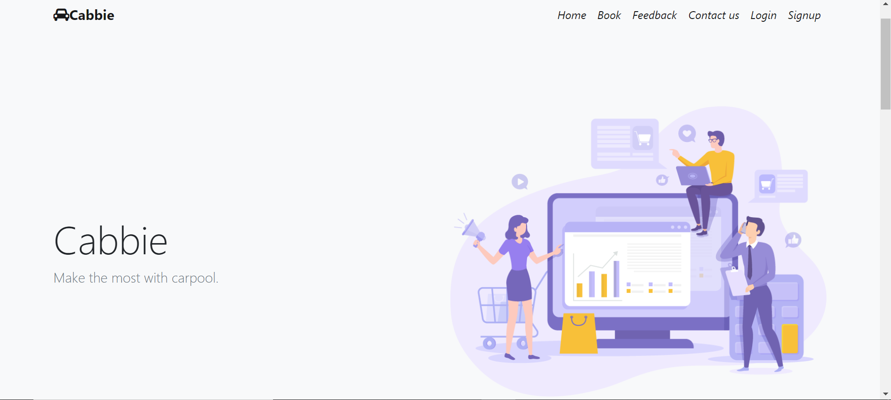
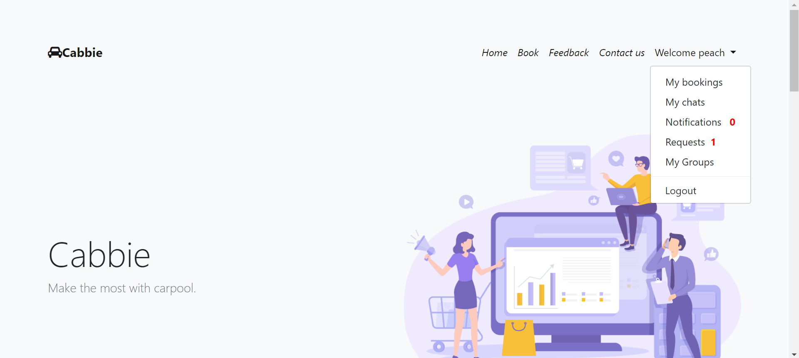
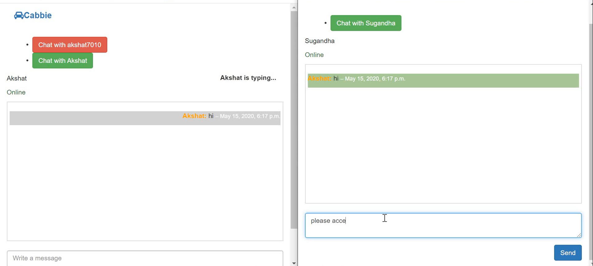
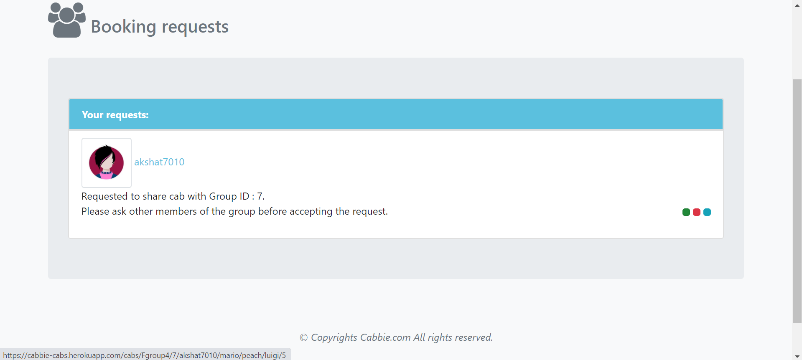
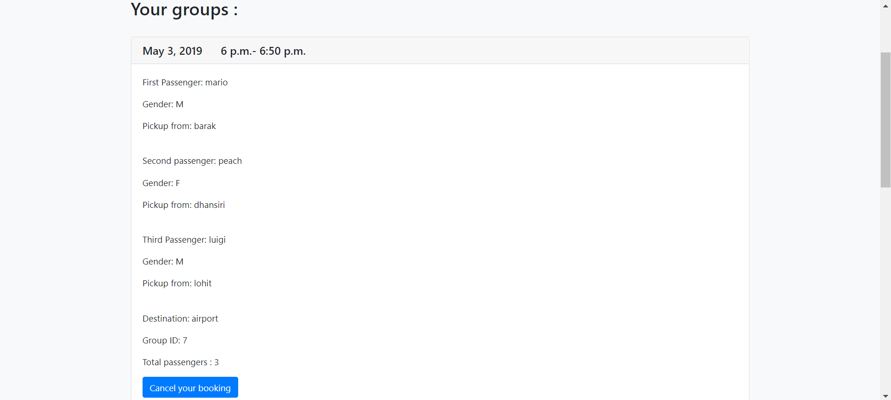
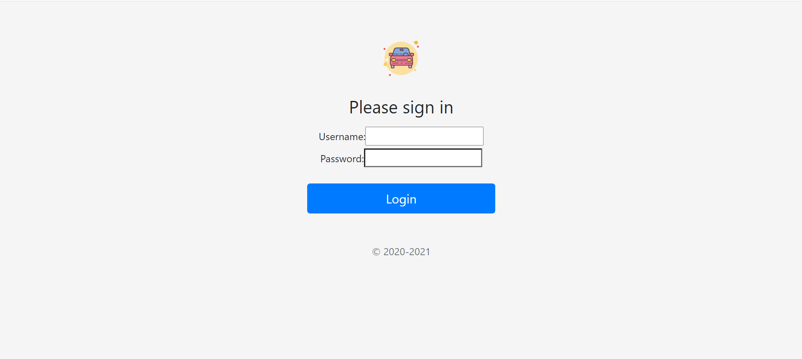

# Cabbie
  
<strong>Cabbie - Share cabs,save money and make your travel fun.<strong> 
 
The aim is to make a website that provides an interface for users to post cab timings and venues. People commuting from one point to another can share empty seats with other passengers who are traveling on the same route. It also has features like inbuilt messaging and emergency booking.   

  
# Stack used
       - Django 
       - django-channels
       - SQlite
   

# How to run?
  - pip install -r requirements.txt
  - cd into project dir
  - python manage.py runserver
  - python manage.py run_chat_server in another window

# Main Features 
   1. Chat feature is avalable with features like shown active status(online/offline) ,shows typing when a person types.
   2. A request based system is used to form groups of matching passengers i.e you have to send the person a request so that he/she can add you to the group.
   3. Groups formed are dynamic and can consist of up to 4 people. 
   4. Live Notifications and an option to provide feedback are present. 
   5. You can leave a group or remove your post at any time.
   6. Groups of upto four people can be formed.

 # Gallery
 
 # chat
  
 
 # Request
   
# Groups
  

# Login
  
